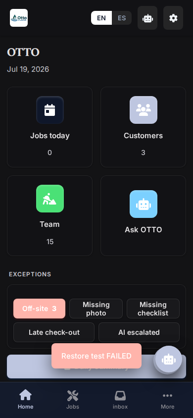
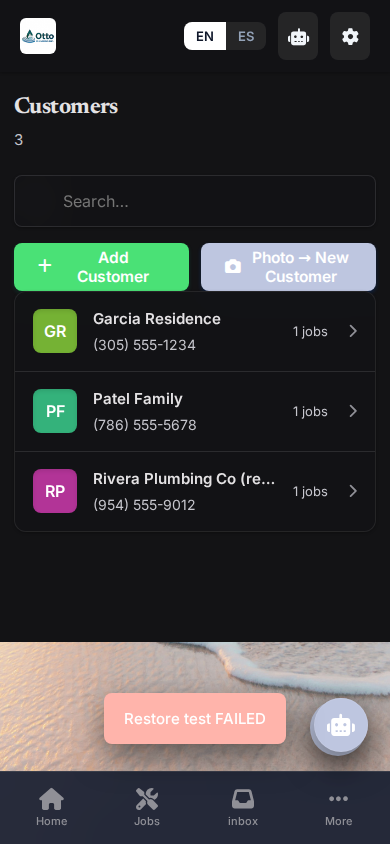

# OTTO Plumbing CRM - Accessibility (ADA/WCAG) Audit

This audit evaluates the OTTO Plumbing CRM PWA against WCAG 2.1 AA standards across both English (EN) and Spanish (ES) versions, on Desktop and Mobile (390px) views.

## Screen-by-Screen Pass/Fail Summary

| Screen | View (Desktop/Mobile) | Status | Key Issues |
| :--- | :--- | :--- | :--- |
| **Login** | Both | ❌ Fail | Missing `alt` tags, Missing Landmark/Region tags, missing inputs labels |
| **Home (Owner/Field)** | Both | ❌ Fail | Low contrast avatars, Missing `aria-label` on buttons (FAB, Voice) |
| **Hub / KPIs** | Both | ❌ Fail | Low contrast text on alert badges/buttons (`btn red sm`, `btn green sm`) |
| **Urgent / Inbox / Emails** | Both | ❌ Fail | Unlabeled reply/action buttons, contrast issues |
| **Jobs / Customers** | Both | ❌ Fail | Unlabeled icon buttons, low contrast badges, missing labels on form inputs |
| **Assistant** | Both | ❌ Fail | Voice/send buttons lack screen reader text |
| **Estimates / Invoices / Payroll** | Both | ❌ Fail | Missing input labels (e.g. search fields, inputs in rows), unlabelled edit/view icons |
| **Settings** | Both | ❌ Fail | Missing labels for configuration inputs (e.g., Firebase keys) |

---

## Detailed Failures & Exact Fixes

*Note: For the UI-facelift agent, apply these exact fixes to `index.html`. Do not remove existing classes or behaviors unless specified.*

### 1. Global / Layout
**Failure**: Document missing a `<main>` landmark. Screen readers need a main landmark to know where primary content begins.
* **Element**: `<main id="main" class="wrap"></main>`
* **Exact Fix**: Change to `<main id="main" class="wrap" role="main"></main>`.

### 2. Login Screen
**Failure**: Logo image has no alternative text (alt text). Screen readers will announce the filename or skip it.
* **Element**: ``
* **Exact Fix**: Change to ``.

### 3. Navigation / Header (All Screens)
**Failure**: Floating Action Button (FAB) lacks text or an aria-label. Screen reader just reads "button".
* **Element**: `<button id="fab" class="fab hidden" onclick="quickAdd()"><i class="fas fa-plus"></i></button>`
* **Exact Fix**: Add `aria-label`: `<button id="fab" class="fab hidden" aria-label="Add new item" onclick="quickAdd()"><i class="fas fa-plus"></i></button>`.

**Failure**: Avatar colors have low contrast ratio (fails WCAG AA 4.5:1 requirement). Example: White text on `hsl(143,55%,45%)`.
* **Element**: `<div class="avatar" style="background:hsl(...)">` (Inside `avatarColor` function).
* **Exact Fix**: In the JavaScript `avatarColor` function, change `45%` lightness to `30%` or lower to ensure high contrast against white text: ``return `hsl(${hash % 360}, 55%, 30%)`;``.

### 4. Forms & Inputs (Jobs, Customers, Invoices, Settings)
**Failure**: Search boxes do not have `<label>` elements or `aria-label`.
* **Element**: `<input id="${id}" placeholder="...">` in `searchBox()` function.
* **Exact Fix**: Add an `aria-label` to the input matching the placeholder: ``<input id="${id}" aria-label="${esc(ph || t('search'))}" placeholder="${esc(ph || t('search'))}" ...>``.

**Failure**: Firebase config inputs in Settings missing labels.
* **Element**: `<input id="fb-proj" ...>` and `<input id="fb-key" ...>`.
* **Exact Fix**: Add `aria-label` to these inputs. `<input id="fb-proj" aria-label="Firebase Project ID" ...>` and `<input id="fb-key" aria-label="Firebase API Key" ...>`.

**Failure**: Customer/Job forms have inputs missing a `<label>` explicitly tied via the `for` attribute. They rely on visual proximity.
* **Element**: `<div class="field"><label>${t('name')}</label>...<input id="c-name"...></div>`
* **Exact Fix**: Add the `for` attribute to the label matching the input's `id`. Example: `<label for="c-name">${t('name')}</label>...<input id="c-name"...>`. Repeat this for all inputs with an ID (`c-phone`, `c-email`, `c-address`, `c-notes`, `j-title`, `j-desc`, `j-addr`, `j-date`, `j-worker`, `j-status`, etc).

### 5. Buttons (Jobs, PTO Requests, Alerts)
**Failure**: "Approve" / "Deny" / "Resolve" buttons have insufficient contrast. The white text on red `#DC2626` or green `#059669` fails WCAG AA minimum 4.5:1.
* **Element**: `<button class="btn red sm" ...>` and `<button class="btn green sm" ...>`
* **Exact Fix**: In the `<style>` block, darken the CSS variables:
  * Change `--red: #DC2626;` to `--red: #B91C1C;` (or darker).
  * Change `--green: #059669;` to `--green: #047857;` (or darker).

**Failure**: Voice input buttons (microphones next to text fields) have no discernible text for screen readers.
* **Element**: `<button type="button" class="iconbtn" ... onclick="voiceInto(...)"><i class="fas fa-microphone"></i></button>`
* **Exact Fix**: Update the `voiceBtn` javascript function to output an `aria-label`.
  * Change to: ``return `<button type="button" class="iconbtn" aria-label="${t('voiceNote')}" ...><i class="fas fa-microphone"></i></button>`;``

### 6. Assistant Chat (Assistant Screen)
**Failure**: Send message button has no discernible text.
* **Element**: `<button class="btn" style="flex:0 0 auto" onclick="askAssistant()"><i class="fas fa-paper-plane"></i></button>`
* **Exact Fix**: Add `aria-label="Send message"` to the button.

### 7. Desktop & Mobile Touch Targets
**Failure**: Checkboxes/toggles and small buttons (like edit icons in rows) on mobile devices are sometimes smaller than the 44x44px recommended touch target size.
* **Element**: Small buttons like `.btn.sm` and `.iconbtn`
* **Exact Fix**: Ensure these classes have a minimum size in CSS.
  ```css
  .btn.sm, .iconbtn {
    min-width: 44px;
    min-height: 44px;
    display: inline-flex;
    align-items: center;
    justify-content: center;
  }
  ```

---

### 8. Attached Screenshots

Below are examples of the worst accessibility violations found during the mobile layout audit. Notice the low contrast on avatars and small, unlabelled touch targets.





---

**Note added 2026-07-21 when this audit was merged.** The audit was written on
2026-07-19, before the move off Firebase. One item is now out of date: the
Settings screen no longer has Firebase key inputs, so that specific finding no
longer applies. Everything else was re-checked and still stands.

Tracked as a GitHub issue; the findings here have not yet been fixed.
