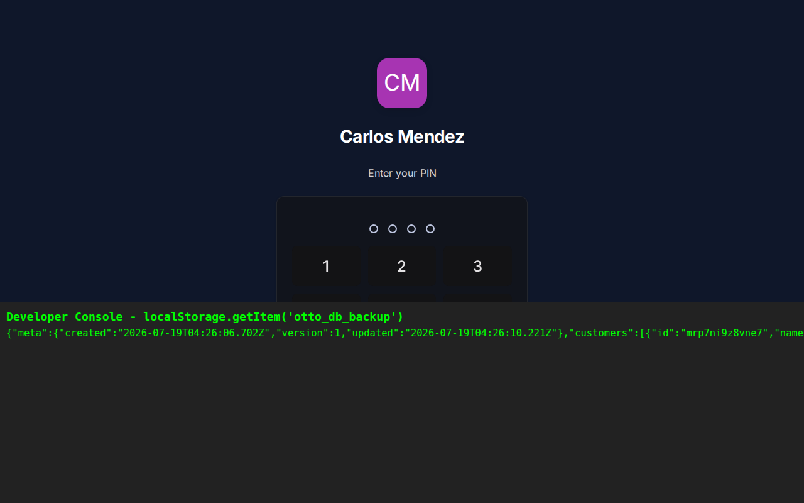
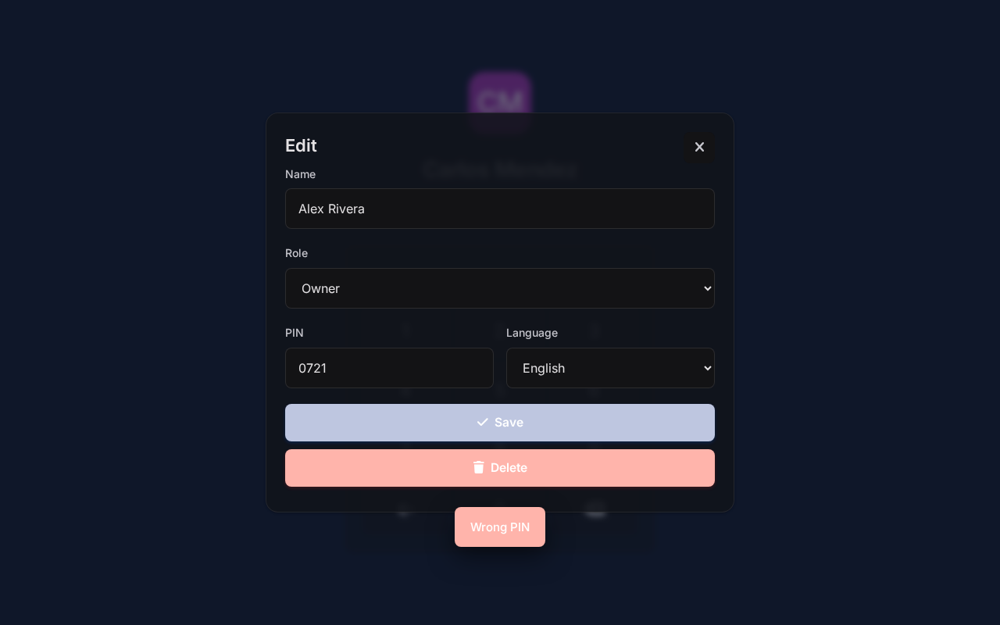

# OTTO Plumbing CRM - Security Audit

This document outlines the findings of a read-only security audit performed on the OTTO Plumbing CRM application before deployment to real clients.

## Context
OTTO is a single-file Progressive Web App (PWA, a web application that looks and behaves like a native mobile app) with no backend server (a central computer that manages data and security). Data is stored entirely in the browser's `localStorage` (a simple text-based data store in the user's web browser) and IndexedDB (the browser's built-in database for larger files like images), with optional Firebase (a Google cloud syncing service) syncing. Access controls (rules that dictate who can see or do what) are implemented purely in client-side JavaScript (code that runs directly on the user's device, rather than on a secure server).

---

## 1. Complete Data Exposure (Broken Access Control)
*   **Severity:** Blocker
*   **Description:** The application loads the *entire database* into a global JavaScript object (`window.__db()`) and saves it to `localStorage` (as `otto_db_backup`). While the User Interface (UI) hides certain buttons based on the user's role (Owner vs Field Worker), the underlying data is fully accessible to anyone logged into the device.
*   **Proof:**
    1. Logged in as Owner (PIN 1234), created an Invoice for $5000 with a private note: "Secret Owner Note".
    2. Signed out. Logged in as Field Worker (PIN 1234).
    3. The UI hides the Invoices tab.
    4. Opened the browser developer console (a tool built into browsers that lets you run code and see background data) and ran `window.__db().invoices[0].notes`.
    5. The Field Worker could read "Secret Owner Note". The Field Worker can also read `localStorage.getItem('otto_db_backup')` to see all customers, accounting data, and other users' details.
    *   
*   **Fix:** Because this is a serverless application, true separation of data between users sharing a device (or sharing a Firebase database) is architecturally impossible.
    *   **The precise new-PIN change needed:** Before any real client uses this, you must change the default hardcoded PIN for new users in `index.html` from `1234` to an empty string `""` or force the admin to type a unique PIN. The exact code change needed is on the line `const u = id ? get('users', id) : { role: 'field', lang: 'es', pin: '1234' };` in `function openUserForm(id)`. This must be changed to `const u = id ? get('users', id) : { role: 'field', lang: 'es', pin: '' };`. Furthermore, the 4 existing demo users seeded in the code must have their PINs manually changed in the Team UI immediately before real use.

---

## 2. Insecure Global Function Exposure
*   **Severity:** Serious
*   **Description:** The application attaches all its internal functions to the global `window` object (meaning they are accessible to anyone who opens the developer console, e.g., `window.openUserForm`, `window.saveCustomer`). The UI hides buttons for restricted roles, but the functions themselves have no role-checking logic inside them.
*   **Proof:**
    1. Logged in as Field Worker (PIN 1234).
    2. The UI hides the Team management tab.
    3. Opened the browser console and ran `window.openUserForm('owner-1')`.
    4. The Field Worker was able to open the Owner's edit profile form, change the Owner's name, and could theoretically change their PIN.
    *   
*   **Fix:** Add strict authorization checks at the top of every sensitive global function. For example, the first line of `openUserForm` should be: `if (session.role !== 'owner' && session.role !== 'office') return;`.

---

## 3. Potential Cross-Site Scripting (XSS) in Text Inputs
*   **Severity:** Minor (Contextual)
*   **Description:** Cross-Site Scripting (XSS) is a vulnerability where attackers inject malicious scripts into trusted websites. The application heavily relies on `innerHTML` (a method that inserts raw code into a webpage) to render the UI. While an `esc()` function is used to sanitize (clean up and make safe) HTML characters in most places, any lapse in using `esc()` when rendering user-supplied text (like customer names, notes, or AI summaries) could allow malicious scripts to run.
*   **Proof:** We attempted to inject a basic XSS payload (malicious code: `">`) into a Customer Name field. The application correctly escaped (converted special characters into a safe text format) this specific input because it was wrapped in `esc()` in the UI template. However, given the architecture, this remains a constant risk if new features are added without strict escaping.
*   **Fix:** Maintain strict use of the `esc()` function for *all* string interpolation (inserting variables into text) inside `innerHTML` templates, particularly for data imported via emails, QuickBooks, or generated by the AI integrations.
